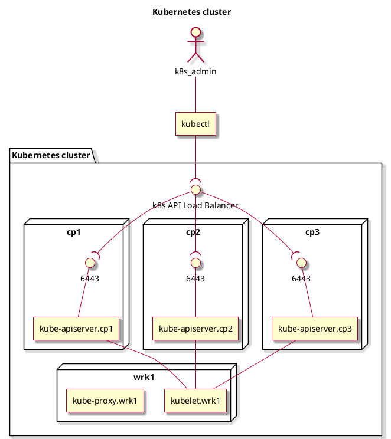

### Design
Read more at: https://kubernetes.io/docs/concepts/overview/components/ .
```yml
# ============================================================================ #
# Author: Tancredi-Paul Grozav <paul@grozav.info>
# ============================================================================ #
kubelet:
  runs_on: all_nodes
  listen_port: [ 10248, 10250 ]
  description: |
    Makes sure containers are running in pods
    Talks the gRPC protocol. Connects to Container Runtime Interface (CRI),
      with which it talks gRPC. CRI is a layer above the Container Runtime.
      For example ContainerD or other container runtime implementations.
      The container runtime actually manages the pods and the containers inside
      the pods.
    It is connecting to the kube-apiserver.
kube-proxy:
  runs_on: all_nodes
  listen_port: 10257
  description: |
    Handles network traffic, rules, etc.
    Also exposes NodePort services to each control-plane node.
kube-utils:
  runs_on: all_nodes
  listen_port: null # does not listen

kube-apiserver:
  runs_on: control_planes
  listen_port: 6443
  client: kubectl
  talks_to:
  - controller-manager
  - scheduler
  - etcd
  - kubelet
  description: |
    Talks to every kubelet from every worker node.
    6443, this port, is the only one that needs to be opened on the node, to be
      able to have a working k8s cluster. Plus any other, defined, NodePorts.
etcd:
  runs_on: control_planes
  listen_port: [ 2379, 2380 ]
  description: |
    Decentralized key-value database storing all the k8s cluster data.
kube-scheduler:
  runs_on: control_planes
  listen_port: 10259
  description: |
    Schedules pods that are created but not assigned to a specific node.
kube-controller-manager:
  runs_on: control_planes
  listen_port: 10257
# ============================================================================ #
```

Diagram:


### Commands
```bash
# Start pod(container) interactively and delete it at the end 
kubectl -n my-ns run my-test-pod --image=alpine:3.15.1 --env k1=v1 --env k2=v2 --stdin --tty --rm=true -- /bin/sh

# Create configmap manually
kubectl create configmap test--config --from-literal=special.how=very --from-literal=special.type=charm
kubectl get configmap test--config -o yaml
```