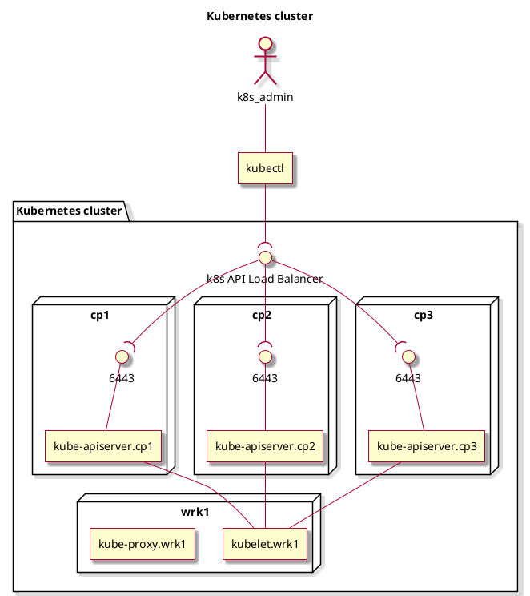

### Why Kubernetes?
We are currently having the bare-metal hardware partitioned similar to: "3 nodes
for DB, 8 nodes for web apps, 4 nodes for C++ backends, 2 nodes for storage,
etc.". Each node has a pre-defined role in the infrastructure, determined by the
service/software that runs on it.


This paradigm has a couple of problems:
1. **Difficult maintenance** - Rebooting the Operating System of a node, or
doing any low-level maintenance on a node is difficult, as it leads to down
time, affecting lots of interconnected systems.
2. **Moving "loads" is expensive** - Moving services (software instances),
between the nodes is an expensive operation, impacting both infrastructure and
software engineers. Such reorganizations are required when a node needs
maintenance, or the software needs to move to a more powerful machine, newer
Operating System, etc.
3. **Inefficient resource utilization** - In the best case, each node is used at
a capacity of 80-90%, leaving room for extra resources that might be needed
going further. Thus, leaving at least 10% unused resources on each node.
Multiply that by at least 10 nodes we have in the co-location, and it turns out
we are keeping at least one node running, and unloaded at the co-location level.
I'm not trying to say this is a power consumption issue. I'm trying to say that
this can be used as a solution to item 1, from above.

As a generic solution, I propose a paradigm shift, in which all processing units
are equal and general-purpose, using
[Kubernetes](https://kubernetes.io/#features) to orchestrate the
load(/services/containers) onto the worker nodes. Sure, a pre-requisite is to
run everything in containers, so that instances can easily be moved across
nodes, by K8s. Those components that are not yet containerized, can run in
ssh-enabled environments/containers, similar to VMs.

By containerizing apps, they are much easier to move across nodes. And by using
the K8s orchestrator, loads are distributed in order to drive up utilization and
save more resources.

Using K8s brings other benefits too:
1. **Resilience** - Loads are moved automatically upon node failure, to a
different node, thus eliminating the need for manual operations under
high-pressure times (sometimes even during night time).
2. Offers **internal DNS and Load Balancing** features out of the box -
decreasing the load for maintaining these in the SysAdmin team. And the good
part is that they are provided with almost no maintenance cost at all, as it's
all handled automatically by K8s.
3. Allows **better secret management** (required by
[HashiCorp Vault](https://www.vaultproject.io/)
[KMS](https://en.wikipedia.org/wiki/Key_management) for
example).
4. Finally we can **move away from shared accounts** at the OS/SSH level.
5. Allows automatic horizontal **scaling** of apps based on demand.
6. Allows automatic progressive **roll outs**/backs.
7. Resource utilization **monitoring** - native per container(,pod, NS) cpu
usage, ram usage, network traffic(in/out), disk IO, and many more.

This is just to name a few, but there are many more.

"Cattle not pets" is a core principle of the
[CNCF](https://en.wikipedia.org/wiki/Cloud_Native_Computing_Foundation), used in
the design of K8s. This means that the whole system is designed to be more
resilient, being able to recover no matter which component dies. Every component
is code-defined and is recreated if not healthy. Even the nodes can be pulled
out of the cluster, and the cluster recovers. So, we shouldn't be emotionally
attached to any piece, we shouldn't invest lots of time and manual effort in a
component(treating it like a pet, and suffering if it dies) - each component can
be killed when the time comes, and recreated with almost no effort(cattle).

Storage plays an important role in K8s. Even though K8s has support for NFS
volumes, which can be provided by a NAS with RAID support, I should emphasize
that lots of the solutions are still suffering from a single point of failure,
and are not really decentralized, because they have only one motherboard to
which multiple storage devices are attached. So we have redundancy for the
storage device, but not for the system(motherboard & OS) that exposes the
storage to the network.

There are a lot of [Cloud Native Storage](
  https://pages.ubuntu.com/rs/066-EOV-335/images/Storage+for+containers+whitepaper.pdf)
solutions, implemented to be really redundant and resilient, such as:
[Ceph](https://ceph.io/en/), [Longhorn](https://longhorn.io/) or
[OpenEBS](https://openebs.io/).


[//]: # (======================================================================)

### Design
Read more at: https://kubernetes.io/docs/concepts/overview/components/ .
```yml
# ============================================================================ #
# Author: Tancredi-Paul Grozav <paul@grozav.info>
# ============================================================================ #
kubelet:
  runs_on: all_nodes
  listen_port: [ 10248, 10250 ]
  description: |
    Makes sure containers are running in pods
    Talks the gRPC protocol. Connects to Container Runtime Interface (CRI),
      with which it talks gRPC. CRI is a layer above the Container Runtime.
      For example ContainerD or other container runtime implementations.
      The container runtime actually manages the pods and the containers inside
      the pods.
    It is connecting to the kube-apiserver.
kube-proxy:
  runs_on: all_nodes
  listen_port: 10257
  description: |
    Handles network traffic, rules, etc.
    Also exposes NodePort services to each control-plane node.
kube-utils:
  runs_on: all_nodes
  listen_port: null # does not listen

kube-apiserver:
  runs_on: control_planes
  listen_port: 6443
  client: kubectl
  talks_to:
  - controller-manager
  - scheduler
  - etcd
  - kubelet
  description: |
    Talks to every kubelet from every worker node.
    6443, this port, is the only one that needs to be opened on the node, to be
      able to have a working k8s cluster. Plus any other, defined, NodePorts.
etcd:
  runs_on: control_planes
  listen_port: [ 2379, 2380 ]
  description: |
    Decentralized key-value database storing all the k8s cluster data.
kube-scheduler:
  runs_on: control_planes
  listen_port: 10259
  description: |
    Schedules pods that are created but not assigned to a specific node.
kube-controller-manager:
  runs_on: control_planes
  listen_port: 10257
  description: |
    Watches for changes in the state of the objects, and make sure that the
    actual state converges towards the new desired state.
# ============================================================================ #
```

Diagram:


### Rename StatefulSet and preserve the volume it claimed.
```bash
# delete current SS first
namespace="httpd--aleph--pgrozav" &&

old_ss_name="httpd-aleph" &&
old_ss_index=0 &&
old_claim_name="httpd-claim" &&

new_ss_name="http-aleph" &&
new_ss_index=0 &&
new_claim_name="http-claim" &&

old_pvc_name="${old_claim_name}-${old_ss_name}-${old_ss_index}" &&
new_pvc_name="${new_claim_name}-${new_ss_name}-${new_ss_index}" &&

# Get PV name, from PVC
# pv_name="$(kubectl -n ${namespace} get \
#   pvc ${old_pvc_name} -o jsonpath='{.spec.volumeName}')" &&
pv_name=pvc-51895257-5482-4007-af28-462a6604e225 &&

# Ensure existing PV is not Deleted when PVC is removed
# kubectl patch pv ${pv_name} \
#   -p '{"spec":{"persistentVolumeReclaimPolicy":"Retain"}}' &&

# Remove PVC (but not PV - data is safe)
# kubectl -n ${namespace} delete pvc ${old_pvc_name} &&

# Ensure PV(data) is there, just Released
# kubectl get pv ${pv_name} &&

# Get yml of PVC before removing it, and just replace the .metadata.name or
# create a custom one from scratch:
( kubectl apply -f - <<EOF
apiVersion: v1
kind: PersistentVolumeClaim
metadata:
  name: ${new_pvc_name}
  namespace: ${namespace}
  annotations:
    helm.sh/resource-policy: keep
spec:
  accessModes:
  - ReadWriteMany
  resources:
    requests:
      storage: 15Gi
  volumeName: ${pv_name}
  storageClassName: longhorn-ssd-1replica
EOF
) &&
# Recreate new SS
true
```

### Reference
<ol>
  <li><a href="https://kubernetes.io/docs/reference/generated/kubectl/kubectl-commands" target="_blank">kubectl</a></li>
  <li><a href="https://kubernetes.io/docs/reference/generated/kubernetes-api/v1.27/#deployment-v1-apps" target="_blank">Kubernetes API</a></li>
  <li><a href="https://www.cncf.io/phippy/" target="_blank">🦒 Phippy - The Illustrated Children’s Guide to Kubernetes</a></li>
</ol>

### Commands
```bash
# Start pod(container) interactively and delete it at the end (NS must exist)
kubectl -n my-ns run my-test-pod --image=alpine:3.15.1 --env k1=v1 --env k2=v2 --stdin --tty --rm=true -- /bin/sh
# Start pod on certain node
kubectl -n my-ns run my-test-pod --overrides='{ "apiVersion": "v1", "spec": { "affinity": { "nodeAffinity": { "requiredDuringSchedulingIgnoredDuringExecution": { "nodeSelectorTerms": [ { "matchExpressions": [ { "key": "kubernetes.io/hostname", "operator": "In", "values": [ "worker-784" ] } ] } ] } } } } }' --image=alpine:3.15.1 --env k1=v1 --env k2=v2 --stdin --tty --rm=true -- /bin/sh

# Create configmap manually
kubectl create configmap test--config --from-literal=special.how=very --from-literal=special.type=charm
kubectl get configmap test--config -o yaml
```

### Annotations vs Labels
Use annotations for things like: build information, versioning, timestamps, or
links to related data, description(a longer sentence).

Use labels for things like: environment, tier, region, or role. Labels are
restricted to a length of 63 characters.


### Joining a cluster
```sh
# List non-expired join tokens on a control-plane:
kubeadm token list
# Create new join token:
kubeadm token create --print-join-command
```

### Resource management
At the container level(inside a pod), you can specify
`Pod.spec.containers[0].resources`:
```yaml
resources:
  request:
    memory: 100Mi
    cpu: 0.1
  limits:
    memory: 150Mi
    cpu: 0.15
```
The **request** defines what would be the normal resource usage of the
application / container. So, this is treated as a minimum resource usage, and
this is used by the Kubernetes Scheduler when it is deciding where to schedule
the pod for running/execution, based on the resource requirements of the pod
(summed for each container inside it), and also based on what is the
availability (in terms of free resources), of each node. This makes sure that
pods are scheduled on nodes that have at least the required resources to run the
pod under normal circumstances.

If the request object(/section) is missing in the definition, the values will
default to the values of the limits object if the limits object exists. If the
limits object does not exist, there will be no restrictions in scheduling the
pod.

The **limits** object defined the maximum amount of resources that can be used
by that pod. Meaning that if the memory used reached the limit, the OOM
(Out-Of-Memory) killer will be invoked, killing processes in that cgroup /
container. And, the CPU usage will be throttled to the limit. However, there is
no guarantee that the container/process will succeed in allocating/using more
memory or cpu, than the amount requested. These extra resource requests will be
authorized by the OS if and only if, there are free resources.

So, for the example above, our application needs (typically) 100 MiB of RAM
memory and 10% of one CPU core to run properly. `0.1` is actually `1/10` of a
CPU core, or `10%`, or also known as `100 millicores` (1000 millicores is a CPU
core) - The yaml values `0.1` and `100m` are valid and have the same meaning.
However, this is the typical usage of our app, but under heavy load, it might
use up to 150 MiB of RAM and 15% of a core, and that is OK, it is acceptable and
should be approved by the OS if possible. That means that our application will
be guaranteed to be allowed to allocate RAM memory up to 100MiB, and the extra
50MiB might be approved or not, based on the OS' availability on that node. So,
at some points in time it might work, at some points it might not. CPU usage is
subject to the same limitations, if there are lots of things to process and the
app needs more than the basic 10%, the extra 5% will be given to our process if
and only if the CPU is idle.

### Resource monitoring
To get resource usage at runtime, you can use:
```sh
paul@alice:~$ kubectl top pod my-server --namespace one
NAME        CPU(cores)   MEMORY(bytes)
my-server   2m           44Mi

paul@alice:~ $ sudo crictl stats 5d704999232ba
CONTAINER       NAME        CPU %   MEM       DISK      INODES   SWAP
5d704999232ba   my-server   0.18    46.74MB   18.78MB   246      0B
```
`kubectl top` expresses the CPU in millicores (the `m` unit at the end). So, the
pod currenly uses 2 millicores, out of those 100m that it is expected to use
under normal circumstances.

`crictl stats` expresses the CPU as % of 1 full CPU core. So, the server,
currently uses (expressed in % or a core): `0.18` out of the `10` that it is
expected to use under normal circumstances.

To make things even more clear(or confusing), the pod with 1 container, uses
approximately 2% of the node resources that "were allocated" by the scheduler
for this pod. In millicores: 2 out of 100. In "% of 1 full core": 0.18 out
of 10, this is the equivalent of 1.8 out of 100 (so, close to 2%). So, just to
emphasize this again, there is a difference between percentage of the resources
allocated for me, and percentage of the CPU core. The process is using 1.8% of
the resources allocated for it. And the process was allocated 10% of 1 full CPU
core. So, that means the process is currently using 0.18% of a CPU core.

Also, if you have the
[metrics-server](https://github.com/kubernetes-sigs/metrics-server) installed
in the `kube-system` namespace, you can fetch metrics from it using:

```sh
paul@alice:~ $ kubectl get --raw \
  "/apis/metrics.k8s.io/v1beta1/namespaces/one/pods" |
  jq '.items[] | select(.metadata.name == "my-server") | .containers[0].usage'
{
  "cpu": "1953909n",
  "memory": "39996Ki"
}
```
This expresses CPU usage in nanocores. So, 1 CPU core = 10^3 millicores = 10^9
nanocores. So, this 1953909n matches the ~2 millicores reported by kubectl top
or ~0.18% reported by crictl stats.

You can also query the kubelet endpoint for prometheus metrics, using:
```sh
# for kubelet_* metrics
paul@alice:~ $ kubectl get --raw "/api/v1/nodes/node-name/proxy/metrics"
# for container_* metrics
paul@alice:~ $ kubectl get --raw \
  "/api/v1/nodes/node-name/proxy/metrics/cadvisor"
# metrics related to resource usage
paul@alice:~ $ kubectl get --raw \
  "/api/v1/nodes/node-name/proxy/metrics/resource"
# Not prometheus metrics - just JSON, but still useful:
paul@alice:~ $ kubectl get --raw \
  "/api/v1/nodes/node-name/proxy/stats/summary"
# Might offer liveness/readiness probe metrics
paul@alice:~ $ kubectl get --raw \
  "/api/v1/nodes/node-name/proxy/metrics/probes"
```
Remember that these are per-node, so each node exposes different metrics,
related to the pods that run on it.

Another approach would be to check the CGroup directly:
```sh
paul@alice:~ $ kubectl get pods --all-namespaces -o json | jq -r \
  '.items[] | [.metadata.namespace, .metadata.name, .metadata.uid] | @tsv' |
  grep my-server
one  my-server  16e6a747-9d40-4120-bbac-ca7cd274fdd9

# The UID of the pod is: 16e6a747-9d40-4120-bbac-ca7cd274fdd9
# Replace - with _ : 16e6a747_9d40_4120_bbac_ca7cd274fdd9
# Check sudo ls -la /sys/fs/cgroup/kubepods.slice/kubepods-pod<NEW_UID>.slice
paul@alice:~ $ ls -l /sys/fs/cgroup/kubepods.slice/kubepods-pod16e6a747_9d40_4120_bbac_ca7cd274fdd9.slice
```
There you can find info about the memory and other resource usage.
