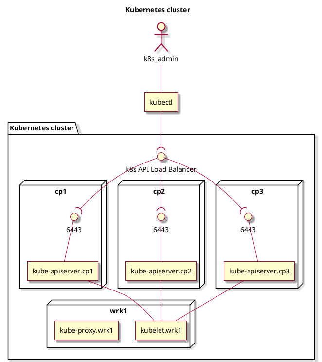

### Why K8s?
# Kubernetes
We are currently having the bare-metal hardware partitioned similar to: "3 nodes
for DB, 8 nodes for web apps, 4 nodes for C++ backends, 2 nodes for storage,
etc.". Each node has a pre-defined role in the infrastructure, determined by the
service/software that runs on it.

This paradigm has a couple of problems:
1. **Difficult maintenance** - Rebooting the Operating System of a node, or
doing any low-level maintenance on a node is difficult, as it leads to down
time, affecting lots of interconnected systems.
2. **Moving "loads" is expensive** - Moving services (software instances),
between the nodes is an expensive operation, impacting both infrastructure and
software engineers. Such reorganizations are required when a node needs
maintenance, or the software needs to move to a more powerful machine, newer
Operating System, etc.
3. **Inefficient resource utilization** - In the best case, each node is used at
a capacity of 80-90%, leaving room for extra resources that might be needed
going further. Thus, leaving at least 10% unused resources on each node.
Multiply that by at least 10 nodes we have in the co-location, and it turns out
we are keeping at least one node running, and unloaded at the co-location level.
I'm not trying to say this is a power consumption issue. I'm trying to say that
this can be used as a solution to item 1, from above.

As a generic solution, I propose a paradigm shift, in which all processing units
are equal and general-purpose, using
[Kubernetes](https://kubernetes.io/#features) to orchestrate the
load(/services/containers) onto the worker nodes. Sure, a pre-requisite is to
run everything in containers, so that instances can easily be moved across
nodes, by K8s. Those components that are not yet containerized, can run in
ssh-enabled environments/containers, similar to VMs.

By containerizing apps, they are much easier to move across nodes. And by using
the K8s orchestrator, loads are distributed in order to drive up utilization and
save more resources.

Using K8s brings other benefits too:
1. **Resilience** - Loads are moved automatically upon node failure, to a
different node, thus eliminating the need for manual operations under
high-pressure times (sometimes even during night time).
2. Offers **internal DNS and Load Balancing** features out of the box -
decreasing the load for maintaining these in the SysAdmin team. And the good
part is that they are provided with almost no maintenance cost at all, as it's
all handled automatically by K8s.
3. Allows **better secret management** (required by
[HashiCorp Vault](https://www.vaultproject.io/)
[KMS](https://en.wikipedia.org/wiki/Key_management) for
example).
4. Finally we can **move away from shared accounts** at the OS/SSH level.
5. Allows automatic horizontal **scaling** of apps based on demand.
6. Allows automatic progressive **roll outs**/backs.
7. Resource utilization **monitoring** - native per container(,pod, NS) cpu
usage, ram usage, network traffic(in/out), disk IO, and many more.

This is just to name a few, but there are many more.

"Cattle not pets" is a core principle of the
[CNCF](https://en.wikipedia.org/wiki/Cloud_Native_Computing_Foundation), used in
the design of K8s. This means that the whole system is designed to be more
resilient, being able to recover no matter which component dies. Every component
is code-defined and is recreated if not healthy. Even the nodes can be pulled
out of the cluster, and the cluster recovers. So, we shouldn't be emotionally
attached to any piece, we shouldn't invest lots of time and manual effort in a
component(treating it like a pet, and suffering if it dies) - each component can
be killed when the time comes, and recreated with almost no effort(cattle).

Storage plays an important role in K8s. Even though K8s has support for NFS
volumes, which can be provided by a NAS with RAID support, I should emphasize
that lots of the solutions are still suffering from a single point of failure,
and are not really decentralized, because they have only one motherboard to
which multiple storage devices are attached. So we have redundancy for the
storage device, but not for the system(motherboard & OS) that exposes the
storage to the network.

There are a lot of [Cloud Native Storage](
  https://pages.ubuntu.com/rs/066-EOV-335/images/Storage+for+containers+whitepaper.pdf)
solutions, implemented to be really redundant and resilient, such as:
[Ceph](https://ceph.io/en/), [Longhorn](https://longhorn.io/) or
[OpenEBS](https://openebs.io/).


[//]: # (======================================================================)

### Design
Read more at: https://kubernetes.io/docs/concepts/overview/components/ .
```yml
# ============================================================================ #
# Author: Tancredi-Paul Grozav <paul@grozav.info>
# ============================================================================ #
kubelet:
  runs_on: all_nodes
  listen_port: [ 10248, 10250 ]
  description: |
    Makes sure containers are running in pods
    Talks the gRPC protocol. Connects to Container Runtime Interface (CRI),
      with which it talks gRPC. CRI is a layer above the Container Runtime.
      For example ContainerD or other container runtime implementations.
      The container runtime actually manages the pods and the containers inside
      the pods.
    It is connecting to the kube-apiserver.
kube-proxy:
  runs_on: all_nodes
  listen_port: 10257
  description: |
    Handles network traffic, rules, etc.
    Also exposes NodePort services to each control-plane node.
kube-utils:
  runs_on: all_nodes
  listen_port: null # does not listen

kube-apiserver:
  runs_on: control_planes
  listen_port: 6443
  client: kubectl
  talks_to:
  - controller-manager
  - scheduler
  - etcd
  - kubelet
  description: |
    Talks to every kubelet from every worker node.
    6443, this port, is the only one that needs to be opened on the node, to be
      able to have a working k8s cluster. Plus any other, defined, NodePorts.
etcd:
  runs_on: control_planes
  listen_port: [ 2379, 2380 ]
  description: |
    Decentralized key-value database storing all the k8s cluster data.
kube-scheduler:
  runs_on: control_planes
  listen_port: 10259
  description: |
    Schedules pods that are created but not assigned to a specific node.
kube-controller-manager:
  runs_on: control_planes
  listen_port: 10257
# ============================================================================ #
```

Diagram:


### Reference
<ol>
  <li><a href="https://kubernetes.io/docs/reference/generated/kubectl/kubectl-commands" target="_blank">kubectl</a></li>
  <li><a href="https://kubernetes.io/docs/reference/generated/kubernetes-api/v1.27/#deployment-v1-apps" target="_blank">Kubernetes API</a></li>
</ol>

### Commands
```bash
# Start pod(container) interactively and delete it at the end 
kubectl -n my-ns run my-test-pod --image=alpine:3.15.1 --env k1=v1 --env k2=v2 --stdin --tty --rm=true -- /bin/sh

# Create configmap manually
kubectl create configmap test--config --from-literal=special.how=very --from-literal=special.type=charm
kubectl get configmap test--config -o yaml
```