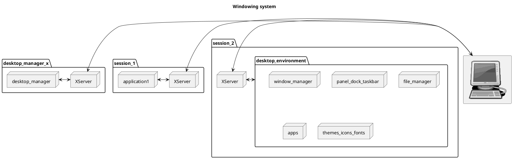

## 0. Window(-ing) system
In computing, a
[windowing system](https://en.wikipedia.org/wiki/Windowing_system) (or window
system) is a software suite that manages separately different parts of display
screens. It is a GUI (Graphical User Interface) that implements the WIMP
(windows, icons, menus, pointer) paradigm for a user interface.

The primary component of a Windowing system is the display server(also called
a compositor), but it encompasses the other components like the window manager
and desktop manager, but also things like concepts/protocols(for example between
the display server and display clients), libraries (`libX11`).

In Unix-like systems, a common windowing system is the
[X Window system](https://en.wikipedia.org/wiki/X_Window_System) (or simply X,
or X11 because it's currently at [version 11](https://en.wikipedia.org/wiki/X_Window_System#Release_history) of the X protocol and of the system), developed
by the [X.Org](https://x.org)
[Foundation](https://en.wikipedia.org/wiki/X.Org_Foundation). The first version
of X was launched in 1984 and originated from a part of
[Project Athena](https://en.wikipedia.org/wiki/Project_Athena) at MIT
(Massachusetts Institute of Technology).

The X window system started as changes brought to the
[W](https://en.wikipedia.org/wiki/W_Window_System), which was the window system
of the [V operating system](https://en.wikipedia.org/wiki/V_(operating_system)),
which is unrelated to the
[UNIX System V](https://en.wikipedia.org/wiki/UNIX_System_V).

Some X.Org developers have created
[Wayland](https://en.wikipedia.org/wiki/Wayland_(protocol)), as a prospective
replacement for the X Window system. This is a more modern system taking
advantage of GPU and hardware features that didn't exist when X was created in
1980s.

Other examples of window systems include:
- [Mir](https://en.wikipedia.org/wiki/Windowing_system#Mir) - by Canonical
- [SurfaceFlinger](
  https://en.wikipedia.org/wiki/Windowing_system#SurfaceFlinger) - by Google for
  Android
- [Quartz Compositor](https://en.wikipedia.org/wiki/Quartz_Compositor) - by
  Apple for macOS.
- [Desktop Window Manager](
  https://en.wikipedia.org/wiki/Desktop_Window_Manager) - by Microsoft for
  Windows

## 1. Display server / Compositor
The display server(also known as Compositor) is responsible with rendering the
graphics (received from the display client applications) on the visual display
and pass the hardware inputs from the end-user to the display client
applications (like keyboard presses and mouse clicks). The visual display can be
a physical display monitor or a virtual memory buffer (works entirely in RAM,
for cases when a physical monitor is not present).

The X Window system offers offers as a display server, the
[X.Org Server](https://en.wikipedia.org/wiki/X.Org_Server) which displays to a
physical monitor, but also [Xvfb](https://en.wikipedia.org/wiki/Xvfb) which
displays to a memory buffer. These are 2 distinct binaries, implementing the
same interface/protocol with the clients, the
[X11 protocol](https://en.wikipedia.org/wiki/Windowing_system#X11).

The role of the "Compositor" is to take the content from each application's
window and combine them into a single image to be displayed on the screen.

While X.Org Server can be ran without a window manager, having one greatly
increases convenience and ease of use.

The X windowing system, though not mandatory, usually starts a Desktop manager
to allow the user to start a fresh session after the system boots. But the
system can also be configured to start a session/program automatically as a
certain user, without loading a desktop manager, window manager, or desktop
environment at all.

Note that you can run multiple instances of the X server on the same computer,
simultaneously(at the same time). But the input/output streams (monitor,
keyboard, etc) are connected to only one at a time. However, you can configure
your system into what's known as a **multi-seat** configuration, which could
allow you to run (for example), simultaneously 2 X servers, each one working
with it's own pair of monitor/keyboard - so, having 2 displays and 2 keyboards
connected to the same motherboard, practically allowing 2 or more people to work
on the same PC unit/case.

The program/application that connects to the X.Org server can even be ran
[remotely](https://en.wikipedia.org/wiki/X_terminal), as is the case with
`ssh -X server xeyes`. This connects to the remote `server` and starts the
`xeyes` application on that computer, but it connects it to the local X.Org
server on my local computer, making my monitor display the visuals and allowing
my mouse & keyboard to interact with it. Even allowing my local window manager
to manage, place and decorate the window the application creates.

When you start a GUI program, you need to decide to which X.Org Server instance
you connect it to. This is typically done through the `DISPLAY` environment
variable, or a CLI parameter.

The X.Org (display) Server has an extension known as
[Xinerama](https://en.wikipedia.org/wiki/Xinerama) which allows it to use two or
more hardware displays(monitors) as one larger virtual display.

[Xephyr](https://en.wikipedia.org/wiki/Xephyr) is an X client that also acts as
a display server that renders the graphics in an X window. Basically allowing
X-on-X nesting.

[Xpra](https://en.wikipedia.org/wiki/Xpra) is another fascinating project that
run X clients, typically on a remote host, and direct their display to the local
machine without the X clients closing or losing any state in case the network
connection between the local machine and the remote host is lost.

## 2. Desktop manager / Display manager / Login manager
The Desktop manager presents the user a login screen and basic settings, before
opening a new graphical session for that user. The graphical session will
usually start a desktop environment for that user.

The display manager will start an X server on the default display and then for
each user that authenticates, it will start a new X server instance in which
a desktop environment will be stared(or just a simple app). The newly started
Xsrv instances will not run(have) a desktop manager instance at all, they
typically run a desktop environment instead.

Note that "Desktop manager" = "Display manager" and roughly = "Login manager"
but the "Display manager" should not be confused with a "Display server"
(Compositor).

The X windowing system provides
[XDM](https://en.wikipedia.org/wiki/XDM_(display_manager)) as the default
display manager in the suite.

## 3. Desktop environment
A Desktop environment is a suite/stack of applications designed to work together
to provide a [Desktop](https://en.wikipedia.org/wiki/Desktop_environment) like
interface experience to the user. So you can think of it as simply as a script
that starts multiple programs. All of these program components will be
configured to connect to the same X.Org Server instance.

The X windowing system kind of stops after the X.Org server, allowing the user
to choose which components to use for each role. So, they definitely didn't want
to create a full desktop environment suite of apps. There are other projects
that do that, like GNOME, KDE, XFCE and others.

However, the *UNIX 98 Workstation Product Standard* environment is the
[CDE (Common Desktop Environment)](
  https://en.wikipedia.org/wiki/Common_Desktop_Environment). It was a closed
source commercial solution until its decline in early 2000s when it was replaced
by the free and open-source alternatives. Eventually CDE was released as open
source in 2012. No newer standard was defined, 

The current "standard" for mission-critical systems is to not run a complete
desktop environment, and instead run only an application and maybe a window
manager if really needed. This is to strip out all unnecessary components and
reduce the attack surface and potential for failure.

## 4. Window manager
A Window manager handles the placement, resizing, and decoration of **all**
windows objects in that X.Org Server instance. This means that you can't run two
instances of a window manager in the same X server instance.

X version 11 Release 4 included [TWM](https://en.wikipedia.org/wiki/Twm) as a
default window manager, but of course, they support any window manager that
adheres to the X11 protocol.

Currently [FVWM](https://en.wikipedia.org/wiki/FVWM), originally based on TWM,
it is now a modern, actively developed, minimal and stable alternative.

## 5. Toolkit
The toolkit is a library that runs on top of the X.Org server. It provides a
higher level of abstraction, giving developers ready-made components like
buttons, text boxes, sliders, and menus. This saves developers from having to
draw every pixel themselves.

## 6. Diagrams
#### Data flow
```txt
Your App (Python / Qt / GTK)
        ↓
Toolkit (Qt, GTK, SDL, etc.)
        ↓
Window system (X11 OR Wayland)
        ↓
Kernel (DRM/KMS, GPU drivers)
        ↓
Hardware
```

#### UML diagram

